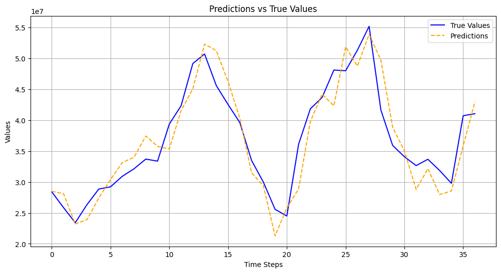
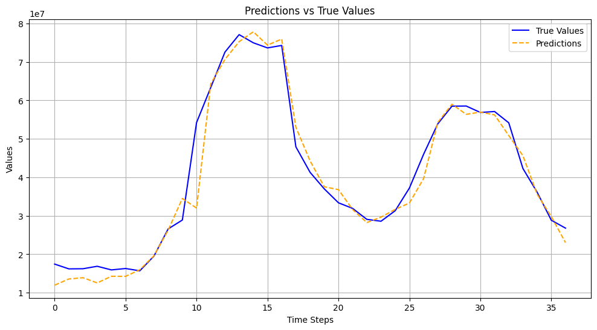
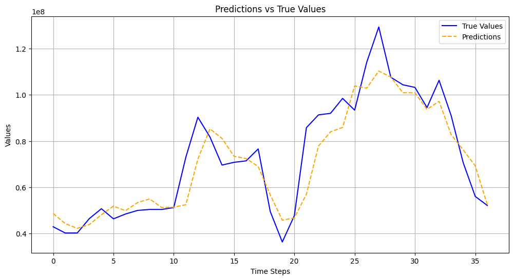
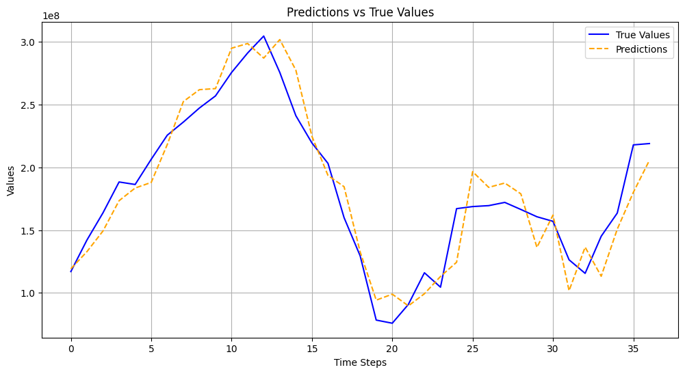

# Final Project - Advanced Signal Processing - 1st Semester 2025
### Facundo Alvarez Motta, Manuel Horn, Ignacio Rodriguez Sañudo

## 🏦 Cash Withdrawal Forecasting in ATMs

This project focuses on forecasting cash withdrawals in ATMs, a challenging task due to the **high daily volatility** in the withdrawal amounts. The goal is to optimize cash replenishment logistics by minimizing shortages or surpluses.

---

## 🎯 Objective

Rather than predicting the exact withdrawal amount for a single day, our approach aims to **predict the sum of withdrawals over the last 7 days**. This strategy smooths out abrupt fluctuations, resulting in a more stable and reliable prediction target.

---

## 🧼 Data Preprocessing

We started with a dataset of approximately **300 ATMs**, filtering out those with more than 15 missing days. For the remaining missing values:

- Withdrawals were set to 0.
- The remaining cash was carried over from the previous day.

Additionally, we enriched the data with several **extra features** for each day:

- **Moving averages**: withdrawals over the past 3, 7, 15, and 30 days.
- **Inflation**: previous month's value.
- **Temporal variables**: weekday, day of the month, month.
- **Special events**: holidays, Christmas, Easter, etc. (based on the Argentine calendar).

After preprocessing, we obtained a clean subset of **~110 ATMs** with complete series.

---

## 🧪 Time Series Clustering

We used **DTW (Dynamic Time Warping)** as a similarity metric to group ATMs with similar withdrawal patterns.

- DTW aligns sequences that may be out of phase in time.
- It is not a formal distance metric (violates the triangle inequality).
- The result was a balanced clustering (e.g., 4 clusters of similar sizes).

---

## 🧠 Model Used: TimesNet

For prediction, we used **[TimesNet](https://arxiv.org/pdf/2210.02186)**, a modern and powerful model for multivariate time series forecasting.

> TimesNet combines multi-scale convolutions, periodic projections, and temporal embeddings to capture patterns at different scales.

This model excels at **Short Forecasting** tasks and has shown competitive performance in recent benchmarks.

---

## 🛠️ Implementation

Instead of coding from scratch, we adapted the implementation from the [official TimesNet repository](https://github.com/thuml/Time-Series-Library), which includes multiple time series models.

- Removed all irrelevant components not used by TimesNet.
- Verified and simplified necessary functions.
- Adapted the workflow to match our ATM dataset.

The result is a clean and functional implementation, tailored for our use case.

---

## 🔧 Key Hyperparameters

- Input window size: `60`
- Embedding dimension: `64`
- Number of layers: `2`
- Learning rate: `1e-3`
- Batch size: `16`
- Epochs: `20`

The model was trained locally on an 18GB GPU.

---

## 📊 Results and Evaluation

We compared the **real vs. predicted sum of withdrawals over 7 days** using:

- **RMSE** (Root Mean Squared Error)
- **MAE** (Mean Absolute Error)

  

  

  

  
*(Illustrative example comparing prediction vs ground truth)*

---

## 📁 Project Structure

- `data/`: raw and processed datasets.
- `layers/`: model' layers scripts.
- `models/`: model scripts.
- `exp/`: experimentation scripts for forecast.
- `notebooks/`: exploratory analysis and clustering.
- `utils/`: utilities for the model.
- `results/`: graphs and evaluation metrics.
- `images/`: handmade folder for Readme.

---

## 📌 Repositories and Videos

- Final project repo: [github.com/facumotta/timeseries-forecastingATM](https://github.com/facumotta/timeseries-forecastingATM)
- Original TimesNet repo: [github.com/thuml/Time-Series-Library](https://github.com/thuml/Time-Series-Library)
- YouTube presentation (Spanish): [YouTube Presentation](https://www.youtube.com/watch?v=dPt5DXMPHTg)

---

> Project carried out as part of the **Advanced Signal Processing** course - University of Buenos Aires (UBA), 1st Semester 2025.

